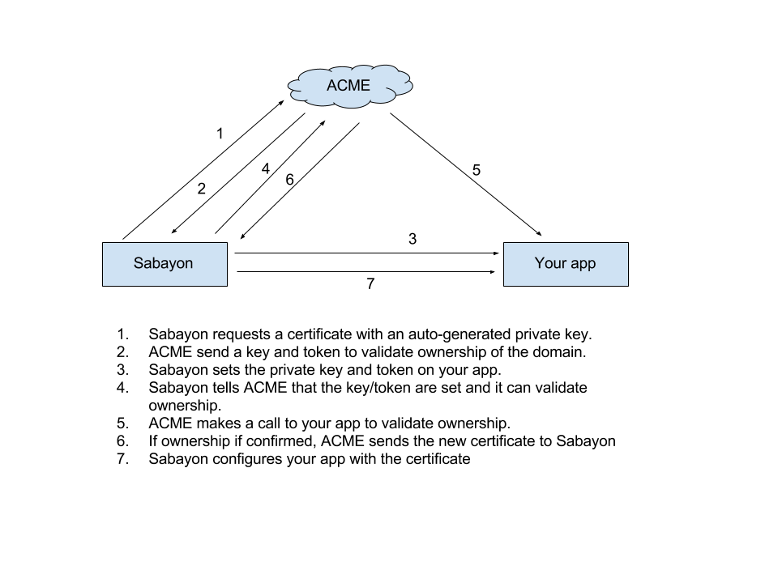

# Sabayon

Automated generation and renewal of ACME/Letsencrypt SSL certificates for Heroku apps.

## Setup

First, you need to let your main app validate the Letsencrypt challenge.

### Static apps

For a [static app](https://github.com/heroku/heroku-buildpack-static)
Change the `web` process type in your Procfile:

    web: bin/start

Add a bin/start file to your app:

    #!/bin/bash -e

    if [[ -n $ACME_KEY && -n $ACME_TOKEN ]]; then
      mkdir -p dist/.well-known/acme-challenge
      echo $ACME_KEY > dist/.well-known/acme-challenge/$ACME_TOKEN
    fi
    bin/boot

Make that file executable:

    chmod +x bin/start

Deploy your main app with those changes.

### Ruby apps

Add the following rack middleware to your app:

    class SabayonMiddleware

        def initialize(app)
          @app = app
        end

        def call(env)
          if env["PATH_INFO"] == "/.well-known/acme-challenge/#{ENV['ACME_TOKEN']}"
            [200, {"Content-Type" => "text/plain"}, [ENV['ACME_KEY']]]
          else
            @app.call(env)
          end
        end
      end
    end

### Other

In any other language, you need to be able to respond to requests on the path `/.well-known/acme-challenge/$ACME_TOKEN`
with `$ACME_KEY` as the content.

Please add any other language/framework by openin a Pull Request.

### Deploy the sabayon app

Click on this button deploy and fill all the required config vars.

You can then generate your first certificate with the following command:

    heroku run sabayon

Open the [scheduler add-on](https://elements.heroku.com/addons/scheduler) provisioned,
and add the following daily command to regenerate your certificate automatically one month before it expires:

    sabayon

### Force-reload a certificate

You can force-reload your app's certificate:

    heroku run sabayon --force
