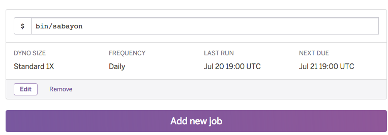

# Sabayon

Automated generation and renewal of ACME/Letsencrypt SSL certificates for Heroku apps.


## Setup

There are three parts to the setup:

1. Configure SNI SSL on your app
2. Setting up the Sabayon app
3. Your application setup

## Heroku's HTTP SNI

This project relies on [Heroku's Free SSL](https://blog.heroku.com/archives/2016/5/18/announcing_heroku_free_ssl_beta_and_flexible_dyno_hours) offering.

## Set up Sabayon app

Sabayon works by running a separate app that will configure letsencrypt for
your main app. To get started, clone this project locally and make a new Heroku
app.

```
$ git clone https://github.com/dmathieu/sabayon.git
$ cd sabayon
$ heroku create letsencrypt-app-for-<name>
```

> Note: Replace `<name>` with the name of your app.

Now deploy your Sabayon app to Heroku

```
$ git push heroku
```

Alternatively you can deploy with the Heroku button:

[](https://heroku.com/deploy)

## Configure Sabayon app

You will need to tell Sabayon a few things about your main app before it can generate tokens for you. You configure it via [config vars](https://devcenter.heroku.com/articles/config-vars).

- `ACME_APP_NAME` this is the name of the Heroku application you're trying to enable SSL on.

For example:

```
$ heroku config:set ACME_APP_NAME=myapp -a letsencrypt-app-for-<name>
```

This would be valid for `http://myapp.herokuapp.com`.

- `ACME_DOMAIN` This is a comma separated list of domains for which you want certificates. Subdomains need different certificates.

For Example:

```
$ heroku config:set ACME_DOMAIN="codetriage.com,www.codetriage.com" -a letsencrypt-app-for-<name>
```

This would be valid for http://www.codetriage.com

- `ACME_EMAIL` This is your email address, it needs to be valid.

```
$ heroku config:set ACME_EMAIL="<youremail>@<example>.com" -a letsencrypt-app-for-<name>
```

- `HEROKU_TOKEN` the API token for the app you're trying to enable SSL on. See the next section

## Create OAuth authorization for HEROKU_TOKEN

The `heroku-oauth` toolbelt plugin can be used to create OAuth authorization.
An access token will be generated for this authorization.
This access token need to be registered as `HEROKU_TOKEN` variable when creating the sabayon app.

```bash
> heroku plugins:install heroku-cli-oauth
> heroku authorizations:create -d "<description-you-want>"
Created OAuth authorization.
  ID:          <heroku-client-id>
  Description: <description-you-want>
  Scope:       global
  Token:       <heroku-token>
```

You can retrieve authorizations information later.
More info: `heroku authorizations --help`.

Take the output of `token` and use it to set the `HEROKU_TOKEN` on your Sabayon app:

```
$ heroku config:set HEROKU_TOKEN="<heroku-token>" -a letsencrypt-app-for-<name>
```

## Set up scheduler for Sabayon

Now that you've set all the configuration variables for your Sabayon app you'll need to configure it to Run automatically.

```
$ heroku addons:create scheduler:standard
```

Visit the resources dashboard for the Sabayon app you created `https://dashboard.heroku.com/apps/letsencrypt-app-for-<name>/resources` (replace `letsencrypt-app-for-<name>` with your app's name).

Then click on "Heroku Scheduler" and add a job to run `bin/sabayon` daily.



The command `bin/sabayon` will attempt to get a new cert when your existing certificate expires (every 90 days) if the certificate is not close to expiring it will exit so it does not renew your certificiate every day.

Once you configure your application you'll want to manually run `heroku run bin/sabayon -a letsencrypt-app-for-<name>` and watch the output to verify a certificate is created and registered correctly. This is covered after "configuring your application".

## Configuring your primary application

Sabayon works be telling letsencrypt the site it wants to generate a certificate for, such as www.codetriage.com. For the cert to be valid
Letsencrypt must verify that we have access to www.codetriage.com. To do this letsencrypt will give us a custom URL and a response. Letsencrypt
then expects your app to return that specific response when it hits that URL, that way it knows you own the site. For example it may say that
when you visit "www.codetriage.com/dist/.well-known/acme-challenge/foo" that it expects the response text "bar". When letsencrypt lets Sabayon
know these values it will set config vars on your main app such as `ACME_KEY=foo` and `ACME_TOKEN=bar`. We need to configure the main app
to read in these environment variables and serve the appropriate response.

Below details how you can configure different types of websites to respond in the correct way

### Static apps

For a [static app](https://github.com/heroku/heroku-buildpack-static)
change the `web` process type in your Procfile:

    web: bin/start

Add a `bin/start` file to your app:

    #!/usr/bin/env ruby
    data = []
    if ENV['ACME_KEY'] && ENV['ACME_TOKEN']
      data << {key: ENV['ACME_KEY'], token: ENV['ACME_TOKEN']}
    else
      ENV.each do |k, v|
        if d = k.match(/^ACME_KEY_([0-9]+)/)
          index = d[1]

          data << {key: v, token: ENV["ACME_TOKEN_#{index}"]}
        end
      end
    end

    result = `mkdir -p dist/.well-known/acme-challenge`
    raise result unless $?.success?
    data.each do |e|
      result = `echo #{e[:key]} > dist/.well-known/acme-challenge/#{e[:token]}`
      raise result unless $?.success?
    end

    exec("bin/boot")

Make that file executable:

    chmod +x bin/start

Commit this code then deploy your main app with those changes.

### Ruby apps

Add the following rack middleware to your app:

```ruby

class SabayonMiddleware
  def initialize(app)
    @app = app
  end

  def call(env)
    data = []
    if ENV['ACME_KEY'] && ENV['ACME_TOKEN']
      data << { key: ENV['ACME_KEY'], token: ENV['ACME_TOKEN'] }
    else
      ENV.each do |k, v|
        if d = k.match(/^ACME_KEY_([0-9]+)/)
          index = d[1]
          data << { key: v, token: ENV["ACME_TOKEN_#{index}"] }
        end
      end
    end

    data.each do |e|
      if env["PATH_INFO"] == "/.well-known/acme-challenge/#{e[:token]}"
        return [200, { "Content-Type" => "text/plain" }, [e[:key]]]
      end
    end

    @app.call(env)
  end
end

```

### Rails apps

Add the previous middleware in an accessible place of your application (such as `lib` if you're including that folder).
Then make rails include that middleware before all others. In `config/application.rb`:

```ruby
config.middleware.insert_before 0, 'SabayonMiddleware'
```
[More info](http://stackoverflow.com/questions/3428343/where-do-you-put-your-rack-middleware-files-and-requires) on loading middleware.

### Go apps

Add the following handler to your app:

```go
http.HandleFunc("/.well-known/acme-challenge/", func(w http.ResponseWriter, r *http.Request) {
  pt := strings.TrimPrefix(r.URL.Path, "/.well-known/acme-challenge/")
  rk := ""

  k := os.Getenv("ACME_KEY")
  t := os.Getenv("ACME_TOKEN")
  if k != "" && t != "" {
  	if pt == t {
  		rk = k
  	}
  } else {
  	for i := 1; ; i++ {
  		is := strconv.Itoa(i)
  		k = os.Getenv("ACME_KEY_" + is)
  		t = os.Getenv("ACME_TOKEN_" + is)
  		if k != "" && t != "" {
  			if pt == t {
  				rk = k
  				break
  			}
  		} else {
  			break
  		}
  	}
  }

  if rk != "" {
  	fmt.Fprint(w, rk)
  } else {
  	http.NotFound(w, r)
  }
})

```

### Express apps

Define the following route in your app.

```js
app.get('/.well-known/acme-challenge/:acmeToken', function(req, res, next) {
  var acmeToken = req.params.acmeToken;
  var acmeKey;

  if (process.env.ACME_KEY && process.env.ACME_TOKEN) {
    if (acmeToken === process.env.ACME_TOKEN) {
      acmeKey = process.env.ACME_KEY;
    }
  }

  for (var key in process.env) {
    if (key.startsWith('ACME_TOKEN_')) {
      var num = key.split('ACME_TOKEN_')[1];
      if (acmeToken === process.env['ACME_TOKEN_' + num]) {
        acmeKey = process.env['ACME_KEY_' + num];
      }
    }
  }

  if (acmeKey) res.send(acmeKey);
  else res.status(404).send();
});
```

### PHP Apps

Add the following to `.well-known/acme-challenge/index.php`

```php
<?php
$request = $_SERVER['REQUEST_URI'];
if(preg_match('#^/.well-known/acme-challenge/#', $request) === 0) {
    return;
}

$data = [];

if(isset($_ENV['ACME_KEY']) && isset($_ENV['ACME_TOKEN'])) {
    $data[] = [
        'key' => $_ENV['ACME_KEY'],
        'token' => $_ENV['ACME_TOKEN'],
    ];
} else {
    foreach($_ENV as $key => $value) {
        if(preg_match('#^ACME_TOKEN_([0-9]+)#', $key)) {
            $number = str_replace('ACME_TOKEN_', '', $key);
            $data[] = [
                'key' => $_ENV['ACME_KEY_'.$number],
                'token' => $_ENV['ACME_TOKEN_'.$number],
            ];
        }
    }
}

foreach($data as $pair) {
    if($pair['token'] == basename($request)) die($pair['key']);
}
```

#### Apache

Add the following to `.well-known/acme-challenge/.htaccess`

```
<IfModule mod_rewrite.c>
RewriteEngine On
RewriteBase /
RewriteRule ^index\.php$ - [L]
RewriteCond %{REQUEST_FILENAME} !-f
RewriteCond %{REQUEST_FILENAME} !-d
RewriteRule . /.well-known/acme-challenge/index.php [L]
</IfModule>
```

#### Nginx

Add this to your `nginx.conf`

```
location ^~ /.well-known/acme-challenge/ {
    allow all;
    # try to serve file directly, fallback to rewrite
    try_files $uri @rewriteacme;
}

location @rewriteacme {
    rewrite ^(.*)$ /.well-known/acme-challenge/index.php/$1 last;
}

location ^~ /.well-known/acme-challenge/index.php {
    try_files @heroku-fcgi @heroku-fcgi;
    internal;
}
```

### Python (Flask)

Add the following route:

```
def find_key(token):
    if token == os.environ.get("ACME_TOKEN"):
        return os.environ.get("ACME_KEY")
    for k, v in os.environ.items():  #  os.environ.iteritems() in Python 2
        if v == token and k.startswith("ACME_TOKEN_"):
            n = k.replace("ACME_TOKEN_", "")
            return os.environ.get("ACME_KEY_{}".format(n))  # os.environ.get("ACME_KEY_%s" % n) in Python 2


@app.route("/.well-known/acme-challenge/<token>")
def acme(token):
    key = find_key(token)
    if key is None:
        abort(404)
    return key
```

### Python (Django)

views.py:

```
import os

from django.http import HttpResponse, Http404


def acme_challenge(request, token):
    def find_key(token):
        if token == os.environ.get("ACME_TOKEN"):
            return os.environ.get("ACME_KEY")
        for k, v in os.environ.items():
            if v == token and k.startswith("ACME_TOKEN_"):
                n = k.replace("ACME_TOKEN_", "")
                return os.environ.get("ACME_KEY_{}".format(n))
    key = find_key(token)
    if key is None:
        raise Http404()
    return HttpResponse(key)
```

urls.py:

```
from . import views


urlpatterns = [
    # ...
    url(r'.well-known/acme-challenge/(?P<token>.+)', views.acme_challenge),
]
```

### Elixir (Phoenix)

in router.ex:

```
get "/.well-known/acme-challenge/:token", App.ACME, :acme_challenge
```

acme.ex:

```
defmodule App.ACME do
  use App.Web, :controller

  def acme_challenge(conn, %{ "token" => token }) do
    case find_key_for_token(token) do
      nil -> send_resp conn, :not_found, ""
      key -> text conn, key
    end
  end

  @spec find_key_for_token(String.t) :: String.t | nil
  defp find_key_for_token(token) do
    System.get_env
    |> Map.keys
    |> Enum.find("", fn(e) -> System.get_env(e) === token end)
    |> (&Regex.replace(~r/TOKEN/, &1, "KEY")).()
    |> System.get_env
  end
end
```

### Other HTTP implementations

In any other language, you need to be able to respond to requests on the path `/.well-known/acme-challenge/$ACME_TOKEN`
with `$ACME_KEY` as the content.

Please add any other language/framework by opening a Pull Request.

## Manually run bin/sabayon

Make sure you have scheduler added to your app and set up to run `bin/sabayon` daily. Now you'll want to manually run `bin/sabayon` to ensure a certificate can be provisioned:

```
$ heroku run bin/sabayon -a letsencrypt-app-for-<name>
```

The output should look something like:

```
2016/07/21 14:02:50 cert.create email='<name>@example.com' domains='[codetriage.com www.codetriage.com]'
2016/07/21 14:02:51 [INFO] acme: Registering account for <name>@example.com
2016/07/21 14:02:51 [INFO][codetriage.com, www.codetriage.com] acme: Obtaining bundled SAN certificate
2016/07/21 14:02:51 [INFO][codetriage.com] acme: Could not find solver for: dns-01
2016/07/21 14:02:51 [INFO][codetriage.com] acme: Could not find solver for: tls-sni-01
2016/07/21 14:02:51 [INFO][codetriage.com] acme: Trying to solve HTTP-01
2016/07/21 14:02:51 cert.validate
2016/07/21 14:03:12 cert.validated
2016/07/21 14:03:15 [INFO][codetriage.com] The server validated our request
2016/07/21 14:03:15 [INFO][www.codetriage.com] acme: Could not find solver for: dns-01
2016/07/21 14:03:15 [INFO][www.codetriage.com] acme: Trying to solve HTTP-01
2016/07/21 14:03:15 cert.validate
2016/07/21 14:03:36 cert.validated
2016/07/21 14:03:40 [INFO][www.codetriage.com] The server validated our request
2016/07/21 14:03:40 [INFO][codetriage.com, www.codetriage.com] acme: Validations succeeded; requesting certificates
2016/07/21 14:03:41 [INFO] acme: Requesting issuer cert from https://acme-v01.api.letsencrypt.org/acme/issuer-cert
2016/07/21 14:03:41 [INFO][codetriage.com] Server responded with a certificate.
2016/07/21 14:03:41 cert.created
2016/07/21 14:03:41 cert.updated
```

> Note your website and email will be different

If you get an error that looks like:

```
ERROR: Challenge is invalid! http://sub.domain.eu/.well-known/acme-challenge/HPdGXEC2XEMFfbgpDxo49MNBFSmzYREn2i1U1lsEBDg
```

Visit the path `/.well-known/acme-challenge/HPdGXEC2XEMFfbgpDxo49MNBFSmzYREn2i1U1lsEBDg` for your website and verify you're getting the correct output. If not re-visit the "Configuring your primary application" section and make sure that your app will respond appropriately.

### Update DNS

After configuring and successfully running Sabayon, you'll likely need to change your DNS settings. Non-SSL apps usually use a `CNAME` or `ALIAS` pointing to `your-app-name.herokuapp.com`, while apps with `http-sni` are accessible at `your-app-name.com.herokudns.com`. You should check your exact DNS target in your Heroku Dashboard under the Settings tab, within the Domains section. Look for "DNS Targets" under "Custom domains".

### Force-reload a certificate

You can force-reload your app's certificate:

    heroku run sabayon --force
